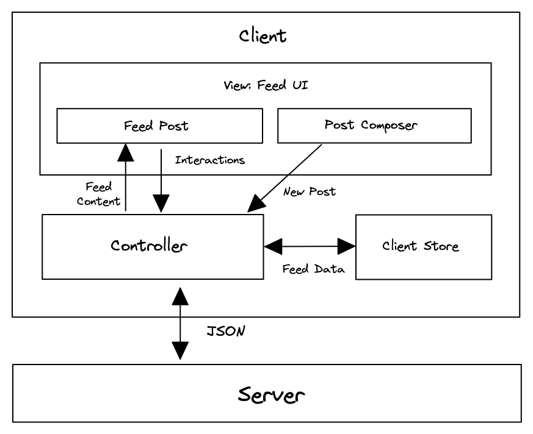

For Front End Engineers, system design interviews are slightly different, there's more emphasis on what goes on in the client and API design between the client and the server, as opposed to what goes on in the back end.

### System Design Comparison

| Aspect                                    | Back End                                                                                                     | Front End                                                         |
| ----------------------------------------- | ------------------------------------------------------------------------------------------------------------ | ----------------------------------------------------------------- |
| Gather requirements                       | Required                                                                                                     | Required                                                          |
| Architecture/High-level design            | Distributed cloud services                                                                                   | Application/Component                                             |
| Back-of-the-envelope estimation           | Required                                                                                                     | Not required                                                      |
| Components of the system                  | Cloud services (e.g. Load balancer, Application server, Database, File storage, Caches, Message queues, CDN) | Application modules (Model, View, Controller)                     |
| Data Model                                | SQL Schema                                                                                                   | Application state                                                 |
| Type of APIs between components           | Network (Any protocol)                                                                                       | Network (HTTP, WebSocket), JavaScript functions                   |
| Focus areas                               | Scalability, Reliability, Availability                                                                       | Performance, User Experience, Accessibility, Internationalization |
| Less important (Can treat as a black box) | Client                                                                                                       | Server                                                            |

### 2 different types of Frontend system design questions: Applications and UI Components

## Applications

- Focus on the parts that are unique to the application and not spend too much time on general stuff.
- Design high-level architecture, identifying components in the system, and the API between the components

## UI Components

- Determine the subcomponents of the component (ie. image corousel, there is the image, pagination buttons, thumbnails).
- External-facing API of the component (options/props the component should accept)
- Describe internal component state.
- API between subcomponents
- Optimizations and considerations for performance, accessibility, user experience, security

| Application             | Examples                                          | Important Areas                                                      |
| ----------------------- | ------------------------------------------------- | -------------------------------------------------------------------- |
| News Feed               | Facebook, Twitter                                 | Feed interactions, Feed pagination approaches, Message/post composer |
| Messaging/Chat          | Messenger, Slack, Discord                         | Message syncing, Real-time chat, Messages list, Chat list            |
| E-commerce Marketplaces | Amazon, eBay                                      | Product listing pages, Product detail pages, Cart, Checkout          |
| Photo Sharing           | Instagram, Flickr, Google Photos                  | Photos browsing, Photos editing, Photos uploading                    |
| Travel Booking          | Airbnb, Skyscanner                                | Search UI, Search results, Booking UI                                |
| Email Client            | Outlook, Apple Mail, Gmail                        | Mailbox syncing, Mailbox UI, Email composer                          |
| Video Streaming         | YouTube, Netflix, TikTok                          | Video player, Video streaming, Video detail page, Recommended videos |
| Collaborative Apps      | Google Docs, Google Sheets, Google Slides, Notion | Real-time collaboration, State syncing                               |
| Drawing                 | Figma, Lucidchart                                 | Rendering approach, Client state/data model                          |
| Maps                    | Google/Apple Maps, Foursquare City Guide          | Map rendering, Displaying locations                                  |
| File Storage            | Google Drive, Dropbox                             | File uploading, File downloading, File explorer                      |
| Video Conferencing      | Zoom, Google Meet                                 | Video streaming, Various viewing modes                               |
| Ridesharing             | Uber, Lyft                                        | Trip booking, Driver location                                        |
| Music Streaming         | Spotify, Apple Music                              | Music player UI, Playlists UI                                        |
| Games                   | Tetris, Snake                                     | Game state, Game loop, Game logic                                    |

## RADIO Framework

### **1. Requirements Exploration**

- Understand problem thoroughly and determine scope by asking clarifying questions (15% of session)
- What specific area should you focus on (if Facebook, news feed, creating posts, etc)
- What are the functional(basic requirements of the product needed to complete core flows) and non-functional requirements(performance, scalibility, user experience)?
- What are the core features to focus on and which are nice-to-have?
- Other questions: desktop/mobile support? offline? main users of the product? performance requirements?

## **2. Architecture/High-level Design**

- Identify key components of the product and how they are related to each other (20% of session)
- Server (APIs that you can call via HTTP/WebSockets)
- View (what the user sees)
- Controller (Module which responds to user interactions and processes data from store/model)
- Model/Store (Where data lives)
- Server Side Rendering or Client Side Rendering (Websites like blogs, documentation sites, e-commerce websites are built using SSR)

#### Things to consider: Separation of concerns. Consider purpose/functionality of each component and what data it should contain. Meant to be modular. Where computation should occur. Should work be done on the client or the server? Tradeoffs

## **3. Data Model**

- Describe data entities, the fields they contain and which components they belong to (10% of session)
- Server-originated Data, usually from a database (user data, feed posts, comments, etc)
- Client-only Data aka state. Does not have to be sent on the server. Data to be persisted (usually user input entered into form fields), Ephemeral data (temporary state that lasts for a short time. ie valuidation, current tab, etc)

| Source     | Entity    | Belongs To   | Fields                                                                     |
| ---------- | --------- | ------------ | -------------------------------------------------------------------------- |
| Server     | `Post`    | Feed Post    | `id`, `created_time`, `content`, `image`, `author` (`a User`), `reactions` |
| Server     | `Feed`    | Feed UI      | `posts` (list of `Posts`), `pagination` (pagination metadata)              |
| Server     | `User`    | Client Store | `id`, `name`, `profile_photo_url`                                          |
| User input | `NewPost` | Composer UI  | `message`, `image`                                                         |

## **4. Interface Definition (API)**

- Define interface(API) between components, functionality of each API, and parameters and responses (15% of session)
- Parts of an API: Name and functionality (HTTP Path), params, return value

## **5. Optimizations and Deep Dive**

- Discuss possible optimization opportunities (40% of session)
- Focus on important areas of the product (performance, race conditions, concurrent modifications)
- Performance
- User Experience
- Network
- Accessibiltiy(a11y)
- Multilingual Support
- Multi-device Support
- Security

# Interface Questions Cheatsheet
- Consolidating requests: If the UI is making too many network requests, you can:
- Debounce/throttle: Rate limit the number of network requests fired.
- Batch requests: Group requests together and make only one single request. This requires the server side to support such a format.
- Caching: If a request with the same parameters has been made recently, can you reuse the previous response and save on a network round trip?
- Request timeouts: You might want to artificially show that the request has failed (timed out) if the request doesn't receive a response after a stipulated duration.
- On demand loading: Lazy load data/component code only when they are needed, instead of loading all at the start.
- Prefetch/preload data: Reduce network latency by prefetching/preloading data right before it is needed so that updates appear instantly.
- Too many items in a list: Refer to the point under "Edge Cases" above.

# Example: News Feed
### Requirements exploration: 
- What are the core features to be supported?
- What kind of posts are supported?
- What pagination UX should be used for the feed?
- Will the application be used on mobile devices?

### Architecture / high-level design
- Component responsibilities
- Server
- Controller
- Client Store
- Feed UI
- Rendering Approach (Server Side Rendering vs Client Side Rendering)

### Data Model
- Fields for each Entity

### Interface Definition
- API Methods, Params(pagination), Responses

### Optimizations
- Feed optimizations
- Infinite scrolling
- Virtualized lists (render posts that are within the viewport)
- Code splitting
- Lazy loading
- Keyboard shortcuts
- Loading indicators
- Dynamic loading count
- Preserving feed scroll position
- Rich text editor format
- Hashtags and Mentions
- Rendering images
- Timestamp rendering (multilingual timestamps)
- Accessibility
